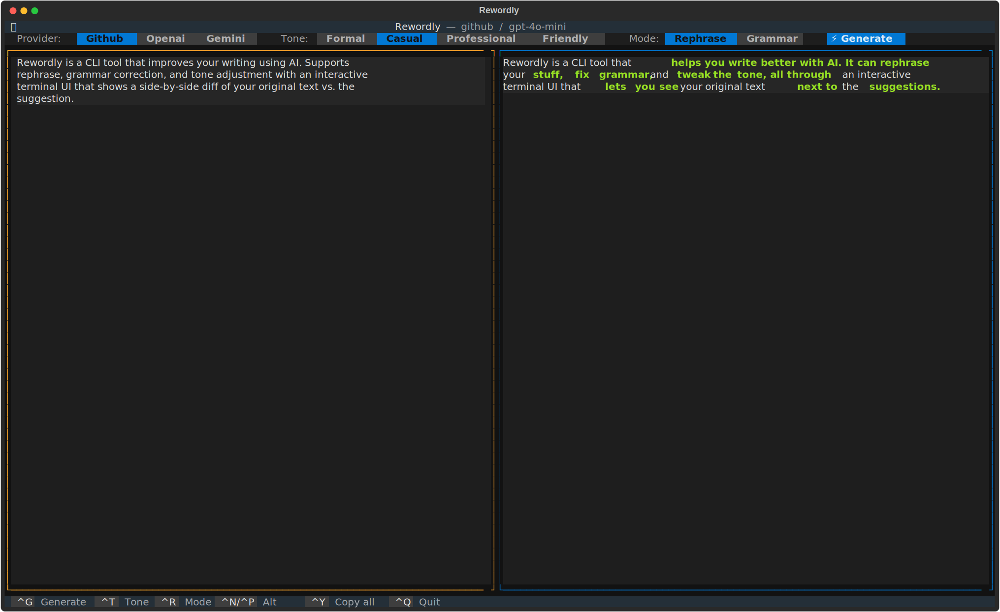

# ✍️ Rewordly

[](LICENSE)

Rewordly is a CLI tool that improves your writing using AI. Supports **rephrase**, **grammar correction**, and **tone adjustment** with an interactive terminal UI that shows a side-by-side diff of your original text vs. the suggestion.



---

## Features

- 🔄 **Rephrase** — rewrite text naturally while preserving meaning
- ✅ **Grammar & style** — fix errors and improve clarity
- 🎭 **Tone adjustment** — formal, casual, professional, or friendly
- 🌍 **Multi-language** — auto-detects language and rewrites in-kind
- ⚡ **Streaming** — suggestions appear token-by-token in real time
- 🎨 **Side-by-side diff** — color highlights show exactly what changed
- 🔌 **Switchable AI provider** — GitHub Models (free), Gemini (free), or OpenAI

---

## Installation

**Requirements:** Python 3.11+

```bash
# Clone the repo
git clone https://github.com/your-username/rewordly
cd rewordly

# Install with pip
pip install -e .

# Or install with uv (recommended)
uv pip install -e .
```

---

## Setup

Copy the example env file and add your credentials:

```bash
cp .env.example .env
```

Then edit `.env` and choose your provider:

### Option A — GitHub Models (free, recommended)

No credit card needed. Uses your GitHub Personal Access Token.

1. Go to [github.com/settings/tokens](https://github.com/settings/tokens) → **Generate new token (classic)**
2. No special scopes are required
3. Add to `.env`:

```env
PROVIDER=github
GITHUB_TOKEN=ghp_your_token_here
```

> **Free tier limits:** ~150 requests/day for `gpt-4o-mini`, lower for larger models.

### Option B — Google Gemini (free via AI Studio)

1. Go to [aistudio.google.com/app/apikey](https://aistudio.google.com/app/apikey)
2. Create a free API key
3. Add to `.env`:

```env
PROVIDER=gemini
GEMINI_API_KEY=AIza_your_key_here
DEFAULT_MODEL=gemini-2.5-flash
```

### Option C — OpenAI (pay-per-use)

```env
PROVIDER=openai
OPENAI_API_KEY=sk-your_key_here
```

---

## Usage

### Interactive TUI (default)

```bash
rewordly
```

Opens a full-screen terminal UI:
- **Left panel** — type or paste your text
- **Right panel** — AI suggestion with color-coded diff

### Direct suggestion (pipe-friendly)

```bash
rewordly "The quick brown fox jumps over the lazy dog."
```

Prints the improved text to stdout — great for scripting.

### CLI flags

```
rewordly [OPTIONS] [TEXT]

Options:
  --provider, -p  TEXT    AI provider: github | openai | gemini
  --model         TEXT    Model name (e.g. gpt-4o, gemini-1.5-pro)
  --tone, -t      TEXT    Tone: formal | casual | professional | friendly
  --mode, -m      TEXT    Mode: rephrase | grammar | tone  [default: rephrase]
```

**Examples:**

```bash
# Use Gemini with a casual tone
rewordly --provider gemini --tone casual "Please advise on the matter at hand."

# Fix grammar only
rewordly --mode grammar "she dont know what she talking about"

# Override model
rewordly --model gpt-4o "Summarize the quarterly results."
```

---

## Keyboard Shortcuts (TUI)

| Key | Action |
|-----|--------|
| `Ctrl+G` | Generate / Regenerate suggestion |
| `Ctrl+T` | Cycle tone (formal → casual → professional → friendly) |
| `Ctrl+R` | Cycle mode (rephrase → grammar → tone) |
| `Ctrl+Y` | Copy entire suggestion to clipboard |
| `Ctrl+C` | Copy selected text (standard, when right panel is focused) |
| `Ctrl+Q` | Quit |

---

## Configuration (`.env`)

| Variable | Default | Description |
|----------|---------|-------------|
| `PROVIDER` | `github` | AI provider (`github`, `openai`, `gemini`) |
| `GITHUB_TOKEN` | — | GitHub PAT for GitHub Models |
| `OPENAI_API_KEY` | — | OpenAI API key |
| `GEMINI_API_KEY` | — | Google Gemini API key |
| `DEFAULT_MODEL` | provider-specific | Model to use |
| `DEFAULT_TONE` | `formal` | Default tone |

---

## Provider & Model Reference

| Provider | Free? | Recommended model | Notes |
|----------|-------|-------------------|-------|
| `github` | ✅ | `gpt-4o-mini` | Free GitHub PAT, ~150 req/day |
| `gemini` | ✅ | `gemini-2.5-flash` | Free AI Studio key |
| `openai` | ❌ | `gpt-4o-mini` | Pay-per-use (~$0.001/request) |
